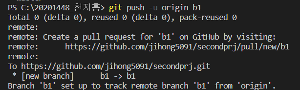

# __*보고서*__

- [GitHub repository URL](https://github.com/jihong5091/secondprj)

<br>

# **목차**

1. [로컬 파일 생성, 기본 설정](#-**1.-로컬-파일-생성**)
2. [git 설정](#git-설정)
3. [Github 연동](#-**3.-Github-연동**)
4. [Github에 소스코드 올리기](#-**4.-Github에-소스코드-올리기**)
5. [브랜치 생성 후 원격 저장소에 저장](#-**5.-브랜치-생성-후-원격-저장소에-저장** )
6. [이전으로 커밋으로 돌아가기](#-**6.-이전-커밋으로-돌아가기** )
7. [두 branch 합치기](#-**7.-두-branch-합치기** )
8. [로그 한줄로 나타내기](#-**8.-로그-한줄로-나타내기**)
9. [Github의 소스 내려받기](#-**9.-Github의-소스-내려받기**)
10. [변경된 소스코드 내려받기](#-**10.-변경된-소스코드-내려받기**)
11. [태그 달고 원격저장소에 올리기](#-**11.-태그-달고-원격저장소에-올리기**)
12. [표](#-**12.-표**)

<br>

# **1. 로컬 파일 생성**

## _- 목적_
- 로컬 파일 생성
## _- 사용된 명령어_
- **init**
- git을 초기화(initialize)한다
- 사용 시 로컬저장소(.git)가 폴더 내에 생성된다.

- _**사용 방법**_

    ```
    git init
    ```
- _**사용**_
    

<br>
<br>

# **git 설정**

## _- 목적_
- user.name과 user.email을 각각 "천지홍", "clara5091@naver.com"으로 바꾸고 싶다.
## _- 사용된 명령어_
- **config**
- config으로 시작하는 명령어는 git에 관한 설정을 추가, 변경, 삭제할 수 있다.

## _- list 확인_

- list 옵션 사용

- _**사용 방법**_

    ```
    git config --list
    ```
- _**사용**_

    

## *- config 설정*

- config --global (해당 항목) (변경사항) 사용 시 Global 설정 파일에 저장함
- config --local (해당 항목) (변경사항) 사용 시 Local 설정 파일에 저장함
    - 다만, local 설정 파일만 설정하면 저장소를 새로 만들 때마다 다시 설정해야 한다.

- _**사용 방법**_

    ```
    git config --global user.name "천지홍"
    git config --global user.email clara5091@naver.com
    ```

- **list로 다시 확인 시 바뀌어 있음**
<br>

    

## _- 이 외의 옵션_

- git config --unset : 항목을 제거할 수 있다.
<br>
<br>

# **3. Github 연동**

## _- 목적_
- github에 생성된 "secondprj" 와 연동해야한다.
## _- 사용된 명령어_
- **remote**
- 원격 저장소와 연결할 수 있게 해준다.
- **사용 방법**

    ```
    git remote add (단축이름 / 기본으로 origin 사용) https://github.com/(이름)/(저장소 이름)
    ```
## - *사용*


## _- 이 외의 옵션_
- git remote -v : 현재 연결되어있는 원격 레파토리를 확인하는 용도
- git remote rm (저장소 이름) : 원격 저장소 삭제

<br>
<br>


# **4. Github에 소스코드 올리기**

## _- 현재 상태_

- 생성된 repository가 연동되어있음
- repository는 비어있음

## _- 목적_

- github에 생성된 "secondprj"에 소스코드를 올림

## _- 사용된 명령어_

- **add** 
- **push**
- **commit** 
- **log** 
- **status** 

<br>

## - *사용*

---


- status를 사용하여 git의 상태를 수시로 확인할 수 있다.
- add가 필요한 것을 확인할 수 있음

---


- add를 통해 작업위치 폴더에 작업한 파일을 staging Area ( commit 진행 전 임시 저장된 상태 )로 옮길 수 있음
- '-m' 옵션으로 명령과 동시에 커밋 메시지를 추가함

---


- 커밋 이력을 확인할 수 있다. 
---


- git push -u 사용
- commit한 이력이 repository로 저장됨
---

## _- 이 외의 옵션_

- git add -A : 작업 디렉토리 상에 어디에 위치하든 항상 동일하게 모든 변경 내용을 스테이징으로 넘깁니다
- git commit -a : 모든 파일 커밋
- git log --graph : 커밋들을 그래프처럼 나열하여 확인할 수 있음
- git status -s(--short) : 현재 변경한 상태를 요약하여 보여줌
- git push -u : 이 옵션 사용 시 앞으로는 간단히 git push만 입력해도 원격저장소에 연결해줌

<br>
<br>

# **5. 브랜치 생성 후 원격 저장소에 저장** 

## _- 현재 상태_

- branch가 존재하지 않음

## _- 목적_

- branch 생성
- 생성된 branch를 github의 "secondprj"에 올림

## _- 사용된 명령어_

- **branch** 
- **push**

## - *사용*

---

- branch나 branch --list로 현재 존재하는 branch를 확인한다.

---

- branch 생성
- 생성 후 명령어를 사용하여 현재 어떤 branch에 위치하고 있는지 확인 가능

---

- 생성된 branch를 push를 사용하여 원격 저장소에 올림

---

<br>

## _- 이 외의 옵션_
- git branch -d (브랜치이름) : branch 삭제
- git branch -v : branch의 마지막 커밋 메세지 확인 가능

<br>
<br>

# **6. 이전 커밋으로 돌아가기** 

## _- 현재 상태_

- b1이라는 branch 존재 (3개의 커밋 존재)
- 현재 branch 위치는 생성된 b1이 아니라 기존의 master에 위치함

## _- 목적_

- b1 branch에 접속 -> 이후 이전 커밋으로 돌아가기

## _- 사용된 명령어_

- **reset** 
- **checkout**
- **branch**

## - *사용*

---

- 현재 branch 위치 확인
- 가고 싶은 branch 위치로 checkout을 사용하여 이동
- git checkout (branch 이름)

---

- git log으로 생성된 커밋 확인

---

- reset을 이용하여 돌아가고 싶은 커밋으로 돌아감
- git reset --hard (커밋의 처음 6자리)

---

<br>

## _- 이 외의 옵션_

- git checkout -b (브랜치명) : 브랜치 생성 후 그 브랜치로 이동함
- git reset HEAD : 직전의 commit을 취소하고 해당 파일들을 unstaged 상태로 워킹 디렉터리에 보존함


<br>
<br>


# **7. 두 branch 합치기** 

## _- 현재 상태_

- b2와 b3이라는 branch 존재
- 각각 3개의 커밋을 걸쳐 b2는 목차를 삭제시켰고, b3은 '1.제목'파트를 삭제함

## _- 목적_

- branch b2에서 b3을 불러와 합침 -> 목차와 1.제목파트를 모두 삭제시킴

## _- 사용된 명령어_

- **merge** 
- **log**

## - *사용*

---

- merge라는 명령어를 사용하여 현재 branch인 b2에서 b3의 변경사항을 불러와 합친다
- git merge (불러올 branch 이름)
- merge의 충돌 (conflict)
    - 서로 다른 파일을 수정했을 때 오류 (x)
    - 서로 같은 파일을 수정했을 때
        - 수정 부분이 다를 때 오류 (x)
        - 수정 부분이 같을 때 오류 (o)
- branch의 충돌을 최대한 예방해야 한다.
    - master branch의 변화를 지속적으로 가져와서 충돌나는 부분을 자주 제거
---

- git --graph --all --decorate 사용 시 모든 로그를 한 눈에 볼 수 있음
- b3가 b2에 merge 된 것을 볼 수 있음

---

## _- 이 외의 옵션_

- git merge --abort : merge 하기 전으로 되돌림

<br>
<br>

# **8. 로그 한줄로 나타내기** 

## _- 현재 상태_

- b1는 b3을 merge하고 있음

## _- 목적_

- b1에서 b3의 log를 한줄로 합쳐 더 간단하게 나타내고 싶다.

## _- 사용된 명령어_

- **rebase** 
- **log**

## - *사용*

---

- git log --graph 을 사용하여 본 로그의 현재 상태
- 두 갈래로 나뉘어져 있음

---

- rebase를 사용하여 간단히 표현
---

- 다시 로그 확인 시 한 줄로 바뀐 것 확인 가능

---


## _- 이 외의 옵션_

- git rebase -i(--interactive) : 중간에 낀 커밋메세지를 수정할 수 있음

<br>
<br>

# **9. Github의 소스 내려받기** 

## _- 현재 상태_

- '복사공간'이라는 새로운 폴더 생성

## _- 목적_

- 이 새로운 폴더에 Github에 올라가 있는 소스코드를 다운받으려 함

## _- 사용된 명령어_

- **clone** 

## - *사용*

---

- 해당 repository의 링크를 복사한다.
---

- git clone (해당 링크) 를 이용하여 소스코드를 다운받는다.
- 사용 후 폴더에 생성된 것을 볼 수 있음

---

## _- 이 외의 옵션_

- git clone -n : 복제가 완료된 이후 HEAD를 checkout하지 않음
- git clone --mirror : 원격 저장소의 복사본을 만듦

<br>
<br>

# **10. 변경된 소스코드 내려받기** 

## _- 현재 상태_

- 해당 repository에 변경사항이 생김

## _- 목적_

- 새로 변경된 내용을 다운받으려 함

## _- 사용된 명령어_

- **pull** 

## - *사용*

---

- git pull (원격명) (브랜치명) 을 사용하여 해당 branch를 새로 받아온다.
---

## _- 이 외의 옵션_

- git pull -u : 원격저장소가 자동으로 설정 됨

<br>
<br>


# **11. 태그 달고 원격저장소에 올리기** 

## _- 현재 상태_

- 새로운 b_new라는 branch 생성됨

## _- 목적_

- 이 branch에 태그를 달려고 한다.
- 이후 이 태그를 원격저장소에 올린다.

## _- 사용된 명령어_

- **tag** 
- **push**

## - *사용*

---

- git tag (tag 이름)을 사용하여 커밋에 태그를 붙인다.
    - 이 때, 지난 커밋에 태그를 붙이고 싶다면, git tag (tag이름) (commit-id) 사용

---

- git tag으로 현재 있는 tag 확인

---

- git push --tag로 모든 태그를 원격 저장소에 올린다.

---

## _- 이 외의 옵션_

- git tag -v (버전명) : 그 버전을 나타내는 태그에 대한 설명(태그 메세지, 태그한 사람,, 등)을 확인 할 수 있음
- git tag -d : 태그 삭제

<br>
<br>

# **12. 표**

| 명령어 | 사용 여부|
|---|:---:|
|add [(1)](#-**4.-Github에-소스코드-올리기**)|o|
|branch [(1)](#-**5.-브랜치-생성-후-원격-저장소에-저장** ) [(2)](#-**6.-이전-커밋으로-돌아가기** )|o|
|checkout [(1)](#-**6.-이전-커밋으로-돌아가기** )|o|
|clone [(1)](#-**9.-Github의-소스-내려받기** )|o|
|commit [(1)](#-**4.-Github에-소스코드-올리기**)|o|
|config [(1)](#-**2.-git-설정**)|o|
|init [(1)](#-**1.-로컬-파일-생성**)|o|
|log [(1)](#-**4.-Github에-소스코드-올리기**) [(2)](#-**7.-두-branch-합치기** ) [(3)](#-**8.-로그-한줄로-나타내기** )|o|
|merge [(1)](#-**7.-두-branch-합치기** )|o|
|pull [(1)](#-**10.-변경된-소스코드-내려받기** )|o|
|push [(1)](#-**4.-Github에-소스코드-올리기**) [(2)](#-**5.-브랜치-생성-후-원격-저장소에-저장** )|o|
|rebase [(1)](#-**8.-로그-한줄로-나타내기**)|o||
|remote [(1)](#-**3.-Github-연동**)|o|
|reset--hard [(1)](#-**6.-이전-커밋으로-돌아가기** )|o|
|status [(1)](#-**4.-Github에-소스코드-올리기**)|o|테스트3|
|tag [(1)](#-**11.-태그-달고-원격저장소에-올리기**)|o|
